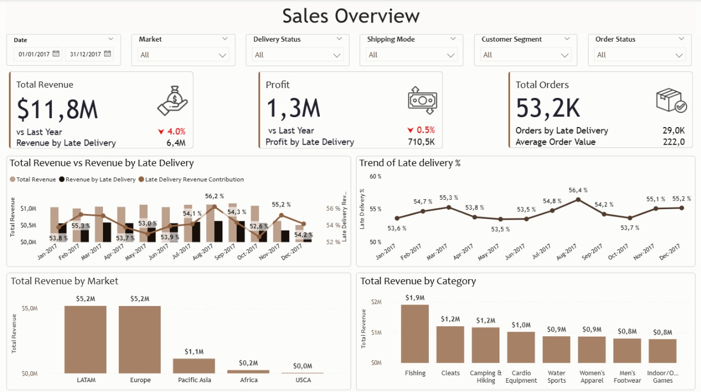
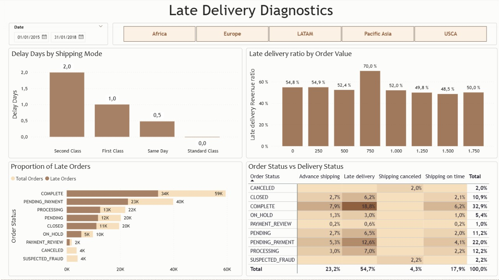

# 📊 Sales & Supply Chain Performance Dashboard

## 🔎 Overview
This project showcases an end-to-end **data analytics workflow** — from cleaning and modeling raw transactional data to developing interactive dashboards that uncover insights into **sales performance, revenue leakage, and supply chain bottlenecks**.  

The main goal was to **transform 3+ years of sales and delivery records** into a decision-support tool that highlights both **business growth** and **operational inefficiencies**.  

---

## 🚀 Key Features
- **Executive KPIs**: Total Revenue, Profit, Orders with YoY comparisons.  
- **Late Delivery Analysis**: Quantifying impact of late deliveries on revenue & profit.  
- **Market Insights**: Regional revenue analysis (Europe, LATAM, USCA, Pacific Asia, Africa).  
- **Product Categories**: Performance split across Fishing, Cleats, Hiking Gear, and more.  
- **Order Status Tracking**: Proportion of late orders across statuses like *Pending Payment*, *Processing*, *Complete*, etc.  
- **Trend Visualizations**: Interactive charts showing revenue contribution and late delivery % over time.  

---

## 🛠️ Tech Stack
- **Data Cleaning & Modeling**: Power Query  
- **Dashboard Development**: Power BI (DAX measures, custom visuals)  
- **Analytics Concepts**: KPI design, YoY growth, contribution analysis  

---

## 📈 Key Insights
(Below numbers for the year 2017)

- Revenue reached $11.8M (🔻 4% YoY), with $6.4M linked to late deliveries.
- Profit is at $1.3M ( 🔻0.5% YoY), though delayed shipments contributed significantly ($710.5K).
- Europe ($6M) and LATAM ($5.6M) led in market revenue, while Africa lagged ($1.2M).
- Product performance revealed Fishing ($1.9M) as the top revenue driver.
- Order bottlenecks: Out of 29K over 5,394 late orders were marked complete while 3,683 remained pending payment.

---

## 📊 Sample Dashboard Previews
### Sales Overview

### Late Orders by Status

---

## 🎯 Impact
This dashboard turns raw data into **actionable business intelligence**, helping decision-makers:  
- Enabled data-driven decision-making by connecting supply chain performance with revenue leakage.
- Helped surface operational inefficiencies (late deliveries, payment delays, incomplete processing).
- Delivered executive-level dashboards that support both strategic business decisions and day-to-day supply chain management. 

---

## 🔑 Skills Demonstrated
- Data Cleaning & Transformation  
- DAX for KPIs & Time Intelligence  
- Business Intelligence & Visualization Design  
- Storytelling with Data  

---
## 📅 Data Source
Kaggle - https://www.kaggle.com/code/simontagbor/demand-forecasting-and-inventory-optimisation/notebook

